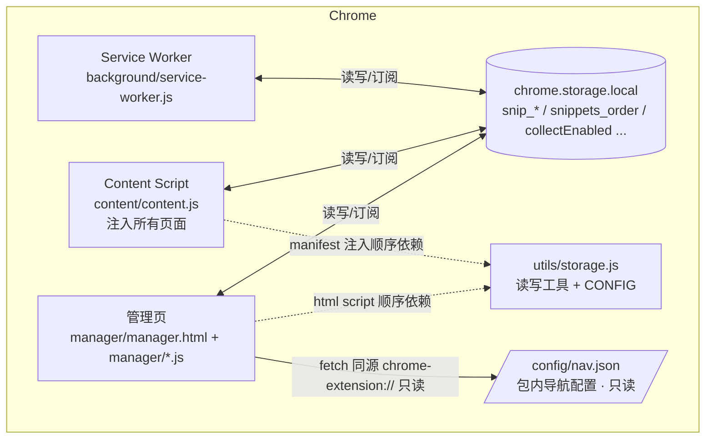

# 技术架构 — 网页文字采集器

> 依据：`docs/_facts.md` 与当前代码（v0.8.1，2026-08-14）。禁止参考 `docs/archive/`。
> 所有结论均可回溯到具体文件；推断处标注。

---

## 1. 技术栈

| 层 | 技术 | 依据 |
|----|------|------|
| 扩展形态 | Chrome Manifest V3 扩展 | `text-collector/manifest.json`（`manifest_version: 3`） |
| 语言 | 原生 JavaScript（ES2018+，无 TypeScript、无转译） | 源码语法与 `package.json`（无 transpile 依赖） |
| 前端 | 原生 DOM API（无框架，无虚拟 DOM） | `manager/*.js` 全部 `document.createElement` 操作 |
| 样式 | 原生 CSS + 自定义属性（`:root` 变量）+ 媒体查询 | `manager/manager.css` |
| 存储 | `chrome.storage.local`（含 `unlimitedStorage` 权限） | `manifest.json`、`utils/storage.js` |
| 脚本加载 | 顶层脚本 + 全局变量共享（无 ES Module 运行时） | `manager.html` `<script>` 顺序引入；manifest content_scripts 数组 |
| 测试 | Vitest（`^4.1.10`），Node 环境，语法提取纯函数 | `package.json`、`vitest.config.js`、`tests/helpers/load-source.js` |
| 图标生成（开发期） | Node 脚本 + sharp（`^0.35.3`） | `design/package.json` |
| 构建/打包 | **无**（源码即产物，无 bundler） | 无 build 脚本；manifest 直接引用源码 |

## 2. 顶层架构图

```
┌────────────────────────── Chrome 浏览器 ──────────────────────────┐
│                                                                   │
│  ┌─ Background Service Worker ─────────────────────────────────┐  │
│  │  background/service-worker.js                               │  │
│  │  · onInstalled/onStartup → 初始化 + badge 同步              │  │
│  │  · action.onClicked → 打开/聚焦管理页                        │  │
│  │  · commands.onCommand(Ctrl+Shift+S) → 切换开关               │  │
│  │  · storage.onChanged → badge 更新                            │  │
│  └──────────────────────────┬──────────────────────────────────┘  │
│                             │ chrome.storage.local（事件订阅）      │
│  ┌──────────────────────────┴──────────────────────────────────┐  │
│  │  共享存储层  chrome.storage.local                           │  │
│  │  snip_<uuid> · snippets_order · collectEnabled ·            │  │
│  │  schemaVersion · orphanScanV1                               │  │
│  └──────────┬───────────────────────────────┬──────────────────┘  │
│             │ 读写（无中转）                  │ 读写 + 订阅          │
│  ┌──────────┴───────────────┐   ┌───────────┴───────────────────┐ │
│  │ Content Script           │   │ 管理页 manager.html           │ │
│  │ （注入所有页面）           │   │ （扩展页面）                    │ │
│  │ content/content.js       │   │ manager.js（编排/状态）        │ │
│  │ content/content.css      │   │ render.js（列表/卡片/删除撤销） │ │
│  │ 依赖 utils/storage.js    │   │ toast.js（通知）               │ │
│  │ （manifest 先行注入）      │   │ modal.js（确认/编辑弹窗）       │ │
│  └──────────────────────────┘   │ export.js（TXT/JSON 导出）     │ │
│                                 │ nav.js（网站导航配置）         │ │
│                                 │ 依赖 utils/storage.js          │ │
│                                 └───────────────────────────────┘ │
└───────────────────────────────────────────────────────────────────┘
```

**要点**：三者（SW / Content Script / 管理页）**不互相直接调用**（无 `runtime.sendMessage`/`onMessage`），统一通过 `chrome.storage.local` 读写 + `chrome.storage.onChanged` 事件同步（高置信度，grep 证实无消息传递代码）。

> v0.8.0 起管理页多一条**只读**边：`manager/nav.js` 用 `fetch(chrome.runtime.getURL('config/nav.json'))` 读取扩展包内配置渲染导航面板；该请求走 `chrome-extension://` 同源协议，**不是外部网络请求**，也不经过 storage。



## 3. 模块划分与职责

| 模块 | 文件 | 职责 | 进程/上下文 |
|------|------|------|-------------|
| 存储工具层 | `text-collector/utils/storage.js` | 全部数据读写封装、`CONFIG` 常量、孤儿收领、去重/扩选、清空、导出读取、开关、估算 | 被注入到 content 与 manager 两份上下文（全局变量方式） |
| 后台服务 | `text-collector/background/service-worker.js` | 安装初始化、badge、图标点击开页、快捷键 | SW（事件驱动，可休眠） |
| 采集内容脚本 | `text-collector/content/content.js` | 选区监听、准入过滤、写库触发、页面内 toast | 每个匹配页面 |
| 采集样式 | `text-collector/content/content.css` | toast 宿主钉死样式 | 注入页面 |
| 管理页入口 | `text-collector/manager/manager.js` | 初始化编排、全局状态（listBridge）、事件绑定、实时订阅、开关/清空/页签/导出菜单 | 管理页 |
| 列表渲染 | `text-collector/manager/render.js` | 分页、卡片、删除/撤销、复制、收藏、编辑、错误态 | 管理页 |
| 弹窗 | `text-collector/manager/modal.js` | `showConfirmModal` / `showEditModal`（自包含） | 管理页 |
| 通知 | `text-collector/manager/toast.js` | 单实例 toast + SVG 图标常量（自包含） | 管理页 |
| 导出 | `text-collector/manager/export.js` | TXT/JSON 生成与下载 | 管理页 |
| 网站导航 | `text-collector/manager/nav.js` + `text-collector/config/nav.json` | 读取包内导航配置、校验规范化、渲染 hover 分栏面板（v0.8.0；不读写 storage，不依赖 manager.js 状态） | 管理页 |
| 管理页样式 | `text-collector/manager/manager.css` | 主题变量、卡片/菜单/弹窗样式、响应式 | 管理页 |
| 测试 | `text-collector/tests/*` + `tests/helpers/load-source.js` | 纯函数单元测试（语法提取） | Node（vitest） |
| 图标工具 | `design/`（make-icons.js / icon-spec.js / preview.js / build-icon.js） | 参数化生成 `icons/icon16/48/128.png` | Node（开发期） |

## 4. 模块依赖关系

### 4.1 静态依赖（脚本加载顺序）

**内容脚本上下文**（`manifest.json` content_scripts）：
```
utils/storage.js → content/content.js
（manifest 声明顺序即执行顺序；content.js 顶部注释确认 CONFIG 先于本文件加载）
```

**管理页上下文**（`manager/manager.html` `<script>` 顺序）：
```
utils/storage.js → toast.js → nav.js → modal.js → render.js → export.js → manager.js
（后者引用前者的全局函数/常量；nav.js 为自初始化的独立模块，不被其他模块引用，也不引用它们）
```

**Service Worker**：单文件，仅依赖 `chrome.*` API，不引用任何项目内模块（`service-worker.js` 头部注释：「采集逻辑在 content script 里直接读写 storage，本文件不做中转」）。

### 4.2 函数级依赖（调用关系）

| 依赖方 | 被依赖方（函数/常量） | 方式 |
|--------|------------------------|------|
| `content/content.js` | `storage.js`: `CONFIG`、`addSnippet` | 全局变量（脚本顺序） |
| `manager/manager.js` | `storage.js`: `adoptOrphanSnippets`、`getCollectEnabled`、`setCollectEnabled`、`getEarliestDate`、`clearAllSnippets`、`filterOrderRecords`、`getFilteredOrder`；`render.js`: `loadFirstPage`、`loadMore`、`prependNewCards`、`renderLoadError`；`toast.js`: `showToast`；`modal.js`: `showConfirmModal`；`export.js`: `handleExport` | 全局函数 |
| `manager/render.js` | `storage.js`: `getSnippets`、`getStorageEstimate`、`deleteSnippet`、`toggleFavoriteSnippet`、`updateSnippetText`、`CONFIG`；`toast.js`: `showToast`、`ICON_*`；`modal.js`: `showConfirmModal`、`showEditModal` | 全局函数 |
| `manager/export.js` | `storage.js`: `getAllSnippets`、`SCHEMA_VERSION`；`toast.js`: `showToast` | 全局函数 |
| `manager/nav.js` | 无模块依赖（仅 DOM + `chrome.runtime.getURL` + `fetch` 包内配置） | — |
| `manager/toast.js` | 无模块依赖（仅 DOM） | — |
| `manager/modal.js` | 无模块依赖（仅 DOM） | — |
| `tests/*.test.js` | 源码文件（`readSource` 读文本 + 语法提取） | Node fs / new Function |
| `design/make-icons.js` | sharp | npm 依赖 |

### 4.3 状态耦合（刻意设计）

`render.js` 等模块**不持有** `currentOffset`/`totalCount`/`isLoading` 等可变状态，统一经 `manager.js` 的 `listBridge`（命名 getter/setter）读写——代码注释：「不在模块间共享可变变量」「一切修改都收敛到本文件的命名函数」。见 `manager/manager.js` 头部注释。

## 5. 关键第三方依赖及用途

| 依赖 | 位置 | 用途 | 运行时是否打包 |
|------|------|------|----------------|
| `vitest ^4.1.10` | `text-collector/package.json`（devDependencies） | 单元测试运行器（`environment: node`） | 否（仅开发期） |
| `sharp ^0.35.3` | `design/package.json`（dependencies） | 图标 PNG 参数化生成（`make-icons.js`） | 否（扩展包不含） |

**无任何运行时第三方依赖**：扩展逻辑全部使用原生 JS + `chrome.*` API（`package.json` 无 dependencies 字段；grep 无 import 外部包）。

## 6. 部署 / 运行方式

### 6.1 安装（手动加载，无构建）

1. Chrome 打开 `chrome://extensions`；
2. 开启「开发者模式」；
3. 「加载已解压的扩展程序」，选择 `text-collector/` 目录（含 `manifest.json` 的文件夹）；
4. 数据落在浏览器 profile 的 `chrome.storage.local`（随浏览器数据存储；卸载扩展后本地数据丢失 —— 此为 `chrome.storage.local` 平台语义，代码未做备份/迁移）。

（来源：`text-collector/README.md`「安装」；`manifest.json`）

### 6.2 测试

```
cd text-collector
npm install        # 安装 vitest（devDependency）
npm test           # vitest run（Node 环境，64 用例：storage 16 + content 39 + nav 9）
npm run test:watch # 监听模式
```

### 6.3 图标生成（开发期，改图标时运行）

```
cd design
npm install        # 安装 sharp
npm run icons      # node make-icons.js → 生成 text-collector/icons/*.png
npm run preview    # node preview.js → 预览图
```

（来源：`design/package.json` scripts；`design/README.md` 已归档外的事实：图标为参数化生成产物，勿手改 PNG —— 此条属 design 文档说明，依据 `design/README.md` 与 `design/icon-spec.js` 存在性）

### 6.4 运行拓扑

| 上下文 | 生命周期 | 入口 |
|--------|----------|------|
| Service Worker | 浏览器事件驱动，可休眠/冷启动 | `manifest.json` background.service_worker |
| Content Script | 每个匹配页面 document_idle 注入 | `manifest.json` content_scripts（`<all_urls>`，all_frames: false） |
| 管理页 | 用户点击图标或直接访问 URL 时创建 | `chrome.runtime.getURL('manager/manager.html')` |

### 6.5 环境要求

- Chrome（MV3 支持）；`<all_urls>` host 权限 + `storage`/`unlimitedStorage`/`tabs` 权限（manifest 原文）。
- 无环境变量、无配置注入（全库 grep 无 `process.env`）。
